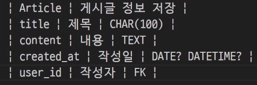
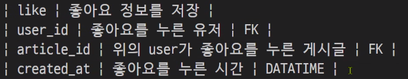

# 일종의 기획서를 작성함 (aka. 알고리즘 수도코드)

"이미 정해져 있는 한가지"
1. 기술스택 = django, djangorestframework

- 무슨 서비스를 만들 것인가?
  1. 회원가입이 가능해야 하며, 회원만 접근 할 수 있는 기능이 있어야 함
  2. 게시글을 작성할 수 있어야 함, 각 게시글마다 댓글을 달 수 있어야 함
  3. 게시글은 유저만 작성
  4. 유저는 다른 유저가 작성한 게시글을 찜하거나 추천할 수 있어야 함
  5. extra 유저 활동 기반 추천 알고리즘을 만듦(하이라키컬, 가우시안 믹스쳐)

- 모델을 정의함
  1. user model
    - django가 기본 제공하는 user model을 사용할 예정
    - 필요에 따라서 user model을 커스터 마이징 해야 할 수 있음
      - 회원가입 시점에 해당 정보를 수집할 수도 있어야 함
     
  2. article model
  - user model과 어떤 관계?
    1. 1:N 관계 (게시글 작성자 정보를 저장해야함)
    2. M:N 관계 (여러명의 유저가 여러 개의 게시글을 `좋아요` 할 수 있어야 함)
    
  
  3. comment model


  4. User-Articel M:N 관계 테이블
   - 누가, 무엇과 관계를 맺는가
   - 1번 유저가 1번 게시글과 관계를 맺음
   - 1번 유저가 2번 게시글과 관계를 맺음
   - 2번 유저가 1번 게시글과도 관계를 맺을 수 있음
   
  

- 기능 정리
  1. 회원가입 요청 방법 => 응답방식
  2. 로그인 요청 방법 => 응답방식
  3. 프로필 요청 방법 => 응답방식
  4. 게시글 작성 요청 방법 => 응답방식
  5. 게시글 전체 조회 요청 방법 => 응답방식
  6. 게시글 수정, 삭제, 상세 조회 요청 방법 => 응답방식
  7. 댓글 등.. => 응답방식

# 요청과 응답
- django에서는 (일반적인 웹 서비스에서는) 어떤 순으로 처리하는가?
  1. 식별 (Client가 요청을 보낼 위치)
  2. 행위
  3. 표현

1. accounts 관련 기능 모음
  1. 회원 가입
    - 요청 방식 `POST accounts/signup/`
    - 응답 데이터
  ```JSON
    {
      "token": "dj-rest-auth가 반환한 토큰값"
    }
  ```
    - 구현 방식: `dj-rest-auth[with-social]` 활용한 registration

2. articles 관련 기능 모음
  1. 게시글 작성
    - 요청 방식 `POST articles/`
    - 응답 방식
  ```JSON
    {
      "title": "문자열",
      "content": "문자열",
      "created_at": "날짜, 시간",
      "createdAt": "날짜, 시간",
    }
  ```
  2. 게시글 상세 조회
    - 요청 방식 `GET articles/{article_id}`
    - 응답 방식
  ``` JSON
    {
      # 게시글이 가진 모든 필드?
      # 댓글에 대한 추가 정보도 보내줄 것이냐?
      "title"
      "content":[
        {
          "id",
          "user_name",
          "content",
        }
      ]
      "created_at
    }
  ```
  - 프로젝트 생성
    1. 프로젝트 원격 저장소 및 초기 세팅
      - 깃헙, 깃랩은?
      - 브랜치는 어떻게?
      - 누구누구는 무슨 역할?
    ```bash
      # 명령어 정리
      $ python -m venv venv
      $ source vent/Scripts/activate
    ```
     