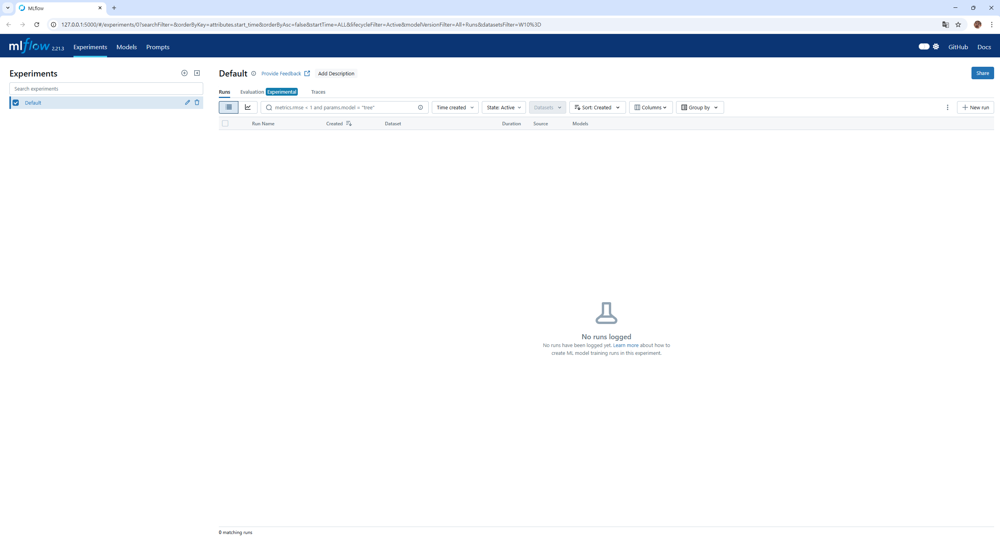

# MLflow – 설치를 진행하고 mlflow가 정상 동작하는지 확인합니다.

## 1. Python 버전 확인
윈도우에 Python이 설치되어 있어야 합니다.

```bash
python --version
```
---

## 2. 가상환경 생성 및 활성화 및 패키지 설치
```bash
# 가상환경 생성
python -m venv ~/venvs/mlflow-env

# Git Bash에서 가상환경 활성화
source ~/venvs/mlflow-env/Scripts/activate

# requirements.txt에 명시된 패키지 설치
pip install -r requirements.txt
```

---

## 3. MLflow 프로젝트 디렉터리 생성 및 파일 정리
```bash
mkdir ~/mlflow_project
cd ~/mlflow_project
```
> 해당 위치에 gitlab에서 pull한 데이터를 놓습니다.

---

## 4. MLflow 환경변수 설정
Git Bash에서 세션 단위로 설정:

```bash
export MLFLOW_TRACKING_URI=http://localhost:5000
```

확인:

```bash
echo $MLFLOW_TRACKING_URI
```

---

## 5. MLflow 버전 확인
```bash
mlflow --version
```

예시 출력:
```
mlflow, version 2.21.3
```
> 가상환경에 설치했으면 해당 가상환경이 실행된 상태에서 확인해야 합니다.
---

## 6. MLflow UI 실행
```bash
mlflow ui --port 5000
```

브라우저에서 접속:  
http://localhost:5000

> UI 확인을 마쳤다면, `Ctrl + C` 로 서버를 종료하세요.  
> 동시에 UI와 서버를 띄우면 포트 충돌이 발생할 수 있습니다.


---